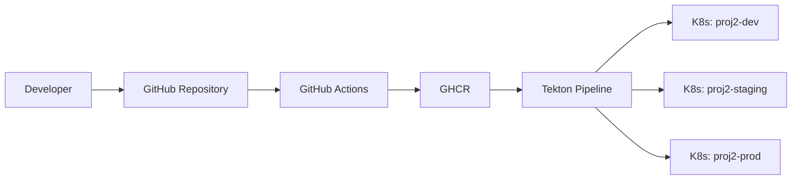

# End-to-End DevOps Pipeline (CI → CD → Promotion → Rollback)


A production-style CI/CD pipeline deploying a Flask application to Kubernetes using **GitHub Actions**, **GHCR**, **Tekton**, and **Kustomize**, with deterministic promotion and rollback across **dev → staging → prod** environments.

---

# Example Application

The pipeline deploys a small Flask application used to demonstrate the full CI/CD workflow.

The application exposes two endpoints:

* `/` → web form that calculates the square of a number
* `/health` → health endpoint used for Kubernetes probes and smoke tests

Example:

```
Input number: 8
Square: 64
```

The application logic is intentionally simple. The goal of this repository is to demonstrate the **delivery architecture**, not application complexity.

---

# Why this project exists

Many repositories demonstrate isolated DevOps tools. This project instead focuses on **end-to-end operational workflow**.

The delivery model implemented here is:

1. code changes are validated through automated tests
2. CI builds immutable container images
3. images are stored in a registry
4. CD deploys a selected artifact
5. environments are promoted deterministically
6. production deploys require explicit approval
7. rollback redeploys a known artifact

This design makes deployments **reproducible, auditable, and operationally clear**.

---

# Stack

## Application

* Python
* Flask
* pytest

## CI

* GitHub Actions

## Container

* Docker
* GitHub Container Registry (GHCR)

## CD / Orchestration

* Kubernetes
* Tekton Pipelines
* Kustomize

## Validation environments

* local Kubernetes (`kind`)
* cloud Kubernetes (`Hetzner` + `K3s`)

---

# Testing approach

The project follows a simple **test-first workflow** using `pytest`.

Tests are executed in CI before container images are built.

Current tests validate:

* application health endpoint
* index page availability
* valid numeric input
* invalid input validation
* empty input validation

Example:

```bash
pytest -q
```

Result:

```
6 passed
```

---

# Architecture

## Architecture overview



CI builds immutable images which are later selected by the Tekton pipeline and deployed to Kubernetes environments.

---

# Key design decisions

## Git stores structure, not image versions

Git manifests describe **environment structure only**.

The image tag is injected at deploy time by Tekton using:

```
kubectl set image
```

This prevents commit-driven tag updates and keeps Git history clean.

---

## Immutable artifact promotion

Promotion is performed by selecting an already built image tag.

Images are **not rebuilt during promotion**, ensuring all environments run the exact same artifact.

---

## Rollback via artifact redeploy

Rollback is executed by redeploying a previous immutable tag, for example:

```
sha-ec5cb7c
```

This approach avoids relying on Kubernetes rollout history and keeps rollback deterministic.

---

## Production safety

Production deployments are protected by two mechanisms:

1. **logical gate**

```
approve_prod=true
```

2. **RBAC separation**

* `tekton-deployer` → dev/staging
* `tekton-deployer-prod` → prod

This limits blast radius and keeps production deployments explicit.

---

# Repository structure

```
app/
  app.py
  templates/
    number_square.html
    result.html

tests/
  test_health.py
  test_square.py

k8s/
  base/
    deployment.yaml
    service.yaml
    kustomization.yaml

  overlays/
    dev/
      kustomization.yaml

    staging/
      kustomization.yaml

    prod/
      kustomization.yaml

tekton/
  tasks/
    git-clone.yaml
    deploy.yaml
    guard-prod.yaml

  pipelines/
    deploy.yaml

  pipelineruns/
    deploy-run.yaml
    deploy-prod-run.yaml

  rbac/

  workspaces/
    pvc.yaml

.github/workflows/
  pipeline.yml
```

---

# Delivery model

## Continuous Integration

GitHub Actions performs:

* run test suite
* build Docker image
* push image to GHCR

Images are tagged with immutable identifiers such as:

```
ghcr.io/bynflow/end-to-end-devops-pipeline:sha-ec5cb7c
```

---

## Continuous Delivery

Tekton pipeline executes:

1. clone repository
2. select environment overlay
3. apply Kubernetes manifests
4. pin the desired image tag
5. wait for rollout completion

---

## Promotion

The same image tag can be promoted across:

* dev
* staging
* prod

without rebuilding the image.

---

## Rollback

Rollback redeploys a previously published immutable tag using the same pipeline.

---

# Environments

| Environment | Namespace       | Deploy mechanism                     |
| ----------- | --------------- | ------------------------------------ |
| Dev         | `proj2-dev`     | Tekton `deploy-run.yaml`             |
| Staging     | `proj2-staging` | Tekton `deploy-run.yaml`             |
| Prod        | `proj2-prod`    | Tekton `deploy-prod-run.yaml` + gate |

---

# Validation completed

## Local validation (`kind`)

Validated successfully:

* dev deploy
* staging promotion
* prod promotion with gate
* rollback to previous artifact

---

## Cloud validation (`Hetzner + K3s`)

Validated successfully:

* K3s cluster bootstrapped on Hetzner
* Tekton installed on remote cluster
* identical pipeline reused successfully
* `/health` endpoint verified in all environments

Example scenario:

* `dev` deployed a newer tag
* `staging` and `prod` intentionally held the previous tag

This confirmed promotion is environment-controlled.

---

# Example commands

## Run dev deployment

```bash
kubectl create -f tekton/pipelineruns/deploy-run.yaml
```

---

## Promote to staging

Edit `deploy-run.yaml`:

```
environment: staging
tag: sha-<target>
```

Then run:

```bash
kubectl create -f tekton/pipelineruns/deploy-run.yaml
```

---

## Deploy to production

Edit `deploy-prod-run.yaml`:

```
environment: prod
approve_prod: "true"
tag: sha-<target>
```

Then run:

```bash
kubectl create -f tekton/pipelineruns/deploy-prod-run.yaml
```

---

## Rollback

Redeploy a previous immutable tag using the same pipeline mechanism.

---

# What this project demonstrates

This repository demonstrates practical understanding of:

* CI vs CD responsibilities
* immutable artifacts
* environment promotion
* Kubernetes deployment architecture
* RBAC separation
* rollout verification
* deterministic rollback
* portability from local cluster to cloud

---

# Limits / conscious simplifications

This is a portfolio project rather than a full production platform.

Some simplifications were intentional:

* no secrets manager integration yet
* no ingress/TLS exposure
* no infrastructure-as-code for Hetzner provisioning in this repo
* no observability stack yet (Prometheus / Grafana / Loki)
* Hetzner validation used a single-node K3s cluster to control cost

These are known next-step improvements rather than missing concepts.

---

# Engineering note

The application is intentionally simple so the repository can focus on the **delivery architecture and operational workflow**.

---

# Author

Carlo Capobianchi (bynflow)

This repository demonstrates a production-style CI/CD architecture designed to showcase practical DevOps engineering skills.

Year: 2026
